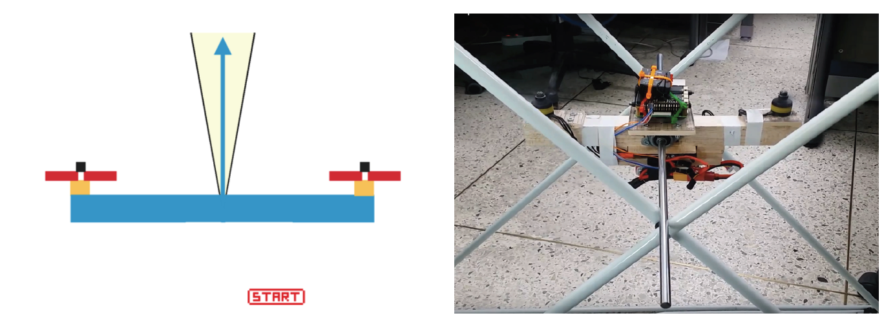

  

# Drone-Hover project
- Contributors : [Taewoo Lee](https://github.com/TaeWoo21/), Jinhoo Ryu 
- Advisor: Heemin Park
- The project is based on [emlid's navio driver](https://github.com/emlid/Navio2)
- research paper: "강화학습을 이용한 1축 드론 수평 제어", 멀티미디어학회논문지 제21권 제2호, 2018.2, 250-260 (11 pages)  
